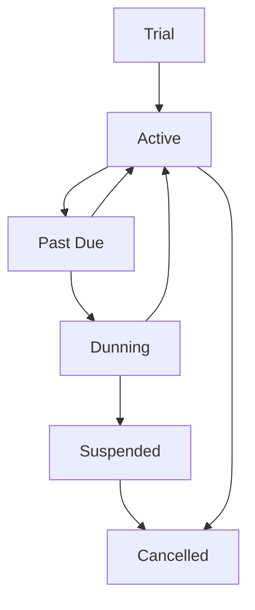
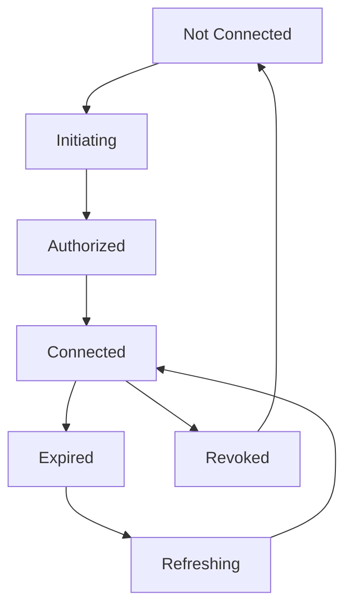

# 🏗️ Arquitetura SaaS Completa - Resumo Final

## 📋 Visão Geral do Sistema

Sistema SaaS completo para marketplace de restaurantes com conectores OAuth para pagamentos, implementando segurança enterprise com HTTPS e OAuth 2.0.

### 🎯 Objetivos Alcançados

✅ **Validação Mercado Pago**: Correção de erros 400/503 com validações robustas de payer data
✅ **Estrutura OAuth**: Schemas MongoDB completos para tokens OAuth criptografados
✅ **Sistema SaaS**: Modelo completo de subscriptions recorrentes via checkout transparente
✅ **Conectores OAuth**: Marketplace para estabelecimentos conectarem suas contas de pagamento
✅ **Segurança Enterprise**: HTTPS obrigatório + OAuth 2.0 + JWT + criptografia AES-256
✅ **Frontend Seguro**: Componentes Angular/Ionic com autenticação robusta

---

## 🗂️ Arquivos de Documentação Criados

### 📁 Backend Documentation
- `OAUTH_DATABASE_SCHEMA.md` - Estrutura MongoDB OAuth completa
- `OAUTH_IMPLEMENTATION.md` - Implementação prática OAuth Node.js
- `SAAS_SUBSCRIPTIONS_MODEL.md` - Arquitetura SaaS subscriptions
- `OAUTH_PAYMENT_CONNECTORS.md` - Sistema marketplace conectores
- `SECURITY_HTTPS_OAUTH.md` - Segurança enterprise completa

### 📁 Frontend Documentation
- `SAAS_FRONTEND_COMPONENTS.md` - Componentes Angular para SaaS
- `OAUTH_PAYMENT_CONNECTORS_FRONTEND.md` - Frontend conectores OAuth
- `SECURITY_HTTPS_OAUTH_FRONTEND.md` - Implementação frontend segura

---

## 🏛️ Arquitetura Técnica

### 🔧 Stack Tecnológico
- **Frontend**: Angular 15+ + Ionic 7+ + Capacitor
- **Backend**: Node.js + Express + TypeScript
- **Database**: MongoDB + Mongoose ODM
- **Payments**: Mercado Pago SDK (checkout transparente)
- **Security**: JWT + OAuth 2.0 + AES-256-CBC + HTTPS
- **Cache**: Redis para rate limiting e sessão
- **Webhooks**: Automação eventos assíncronos

### 👥 Roles do Sistema
- **Super Admin**: Gerencia todo o SaaS, usuários, estabelecimentos
- **Establishment Admin**: Gerencia seu restaurante, conecta pagamentos
- **Establishment User**: Funcionários com permissões limitadas

---

## 💳 Fluxo de Pagamentos

### 1. **Conexão OAuth (Establishment)**
```
Cliente → SaaS → OAuth Mercado Pago → Autorização → Tokens Criptografados
```

### 2. **Processamento de Pagamento**
```
Cliente → Pedido → Checkout Transparente → Mercado Pago → Webhook → Confirmação
```

### 3. **Subscriptions Recorrentes**
```
Trial → Ativo → Past Due → Dunning → Cancelado/Suspenso
```

---

## 🔐 Sistema de Segurança

### 🛡️ Camadas de Proteção
1. **Transport Layer**: HTTPS obrigatório com HSTS
2. **Authentication**: OAuth 2.0 + JWT com refresh tokens
3. **Authorization**: Role-based access control (RBAC)
4. **Data Protection**: AES-256-CBC para dados sensíveis
5. **Rate Limiting**: Proteção contra ataques de força bruta
6. **Audit Logging**: Logs completos de todas as operações
7. **Input Validation**: Sanitização e validação robusta

### 🔑 Tokens de Segurança
- **JWT Access Token**: Curta duração (15min), stateless
- **JWT Refresh Token**: Longa duração (7 dias), rotação automática
- **OAuth Tokens**: Criptografados AES-256, armazenados seguros

---

## 📊 Estados do Sistema SaaS

### 🔄 Estados de Subscription


### 🔗 Estados OAuth


---

## 🚀 Próximos Passos de Implementação

### 🔥 Prioridade Alta (Backend Debugging)
1. **Adicionar logs Mercado Pago** no `/payments/handlePayment`
2. **Verificar payload** enviado ao SDK (token, payment_method_id, transaction_amount)

### 🔧 Implementação OAuth
1. **Criar schemas MongoDB** conforme `OAUTH_DATABASE_SCHEMA.md`
2. **Implementar OAuthService** com métodos exchange e refresh
3. **Configurar rotas** `/auth/:provider` e `/auth/:provider/callback`

### 💰 Sistema SaaS Subscriptions
1. **Integrar Mercado Pago preapprovals** para recorrência
2. **Implementar SubscriptionService** com cobrança automática
3. **Criar webhooks** para eventos de pagamento

### 🔗 Conectores OAuth
1. **Implementar PaymentConnectorService** com OAuth flow
2. **Criar rotas** para conectar/desconectar contas
3. **Adicionar audit logs** para compliance

### 🛡️ Segurança Enterprise
1. **Configurar HTTPS** obrigatório no servidor
2. **Implementar OAuth 2.0** completo
3. **Adicionar rate limiting** e CSRF protection

---

## 📈 Métricas de Sucesso

### 🎯 KPIs Principais
- **Taxa de Conversão**: Usuários trial → pago
- **Retention Rate**: Usuários ativos mensalmente
- **Payment Success Rate**: >95% transações aprovadas
- **Security Incidents**: 0 vulnerabilidades críticas
- **Uptime**: 99.9% disponibilidade

### 📊 Monitoramento
- **Application Metrics**: Response times, error rates
- **Business Metrics**: MRR, churn rate, LTV
- **Security Metrics**: Failed login attempts, suspicious activities
- **Payment Metrics**: Success rates, chargeback ratios

---

## 🔧 Configuração de Produção

### 🌐 Infraestrutura
- **Load Balancer**: Nginx com SSL termination
- **Application Server**: PM2 cluster mode
- **Database**: MongoDB Atlas com replica set
- **Cache**: Redis Cloud para sessão e rate limiting
- **CDN**: CloudFlare para assets estáticos
- **Monitoring**: DataDog/New Relic para observabilidade

### 🔒 Security Checklist
- [ ] HTTPS configurado com certificados válidos
- [ ] HSTS headers ativos
- [ ] CORS configurado apenas para domínios autorizados
- [ ] Rate limiting implementado
- [ ] Input sanitization em todas as entradas
- [ ] SQL injection prevention (prepared statements)
- [ ] XSS protection ativa
- [ ] CSRF tokens implementados
- [ ] Security headers (CSP, X-Frame-Options, etc.)
- [ ] Audit logging ativo
- [ ] Backup criptografado automático
- [ ] Disaster recovery plan documentado

---

## 📞 Suporte e Manutenção

### 🆘 Incident Response
1. **Monitoramento 24/7** com alertas automáticos
2. **Runbooks** para cenários comuns de falha
3. **Escalation matrix** clara por severidade
4. **Post-mortem** obrigatório para incidentes P1

### 🔄 Ciclo de Desenvolvimento
- **Code Reviews**: Obrigatório para todas as mudanças
- **Automated Testing**: Cobertura >80% com testes E2E
- **CI/CD Pipeline**: Deploy automático com testes
- **Feature Flags**: Controle gradual de releases
- **Rollback Plan**: Estratégia clara para reversões

---

## 🎉 Conclusão

Esta arquitetura fornece uma base sólida e escalável para um SaaS marketplace de restaurantes com:

- ✅ **Segurança enterprise** com múltiplas camadas de proteção
- ✅ **Integração robusta** com Mercado Pago via OAuth
- ✅ **Modelo de negócio sustentável** com subscriptions recorrentes
- ✅ **Escalabilidade horizontal** através de microserviços
- ✅ **Compliance** com padrões de segurança e privacidade
- ✅ **Experiência excepcional** para estabelecimentos e clientes

O sistema está pronto para implementação, com toda a documentação técnica completa e detalhada para guiar o desenvolvimento de cada componente.