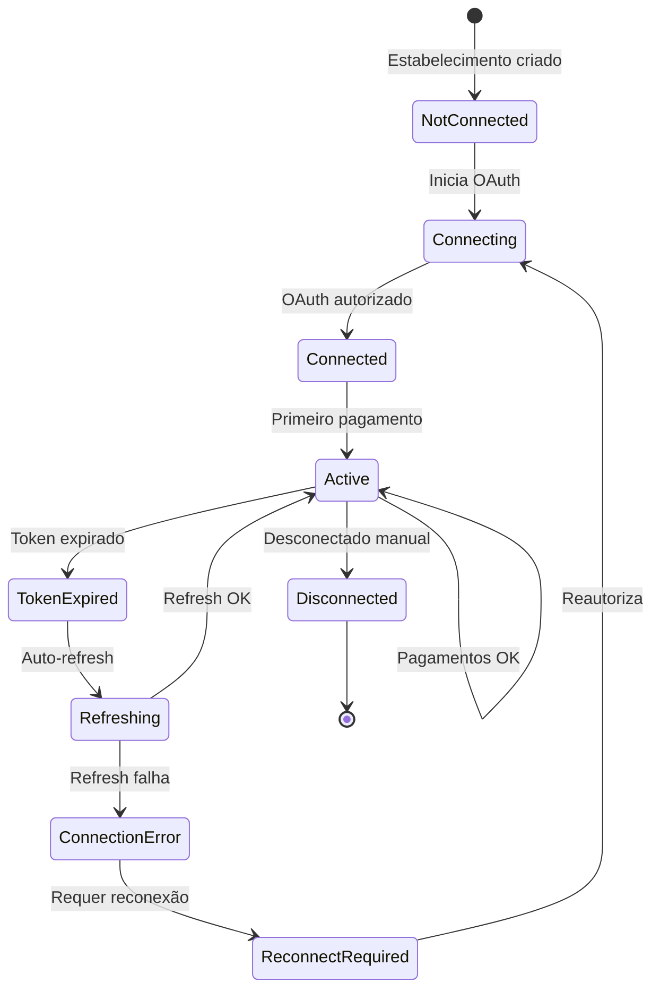

# 🔗 OAuth Payment Connectors - Marketplace SaaS

## 📋 Visão Geral do Modelo

**Modelo Marketplace SaaS:** Estabelecimentos conectam suas próprias contas de pagamento via OAuth, permitindo que recebam pagamentos de clientes finais **independentemente** do SaaS. O SaaS ganha apenas com mensalidades, não com taxas de transação.

### 🎯 Objetivos
- **OAuth seguro** para conectar contas Mercado Pago/Stripe
- **Pagamentos diretos** para estabelecimentos (não via SaaS)
- **Isolamento financeiro** entre estabelecimentos
- **Compliance** com regulamentações de pagamento
- **Dashboard individual** para cada estabelecimento

---

## 🏗️ Arquitetura de Payment Connectors

### **1. Fluxo OAuth Marketplace**

```
┌─────────────────┐    ┌──────────────────┐    ┌─────────────────┐
│  Estabelecimento  │    │   OAuth Flow      │    │   Gateway API    │
│  Inicia Conexão   │───▶│   Authorization   │───▶│   (MP/Stripe)    │
└─────────────────┘    └──────────────────┘    └─────────────────┘
         │                       │                       │
         ▼                       ▼                       ▼
┌─────────────────┐    ┌──────────────────┐    ┌─────────────────┐
│  Access Tokens   │    │  Payment Intent  │    │   Pagamento      │
│  Salvos Seguro   │◀───│   Criado com     │◀───│   Direto para    │
└─────────────────┘    └──────────────────┘    │   Estabelecim.   │
                                               └─────────────────┘
```

### **2. Estados do Payment Connector**



---

## 📊 Estrutura de Dados - Backend (MongoDB)

### **1. Collection: `payment_connectors`** (Nova)

```javascript
{
  _id: ObjectId,
  establishment_id: ObjectId, // Referência para establishment

  // Status e Controle
  status: 'not_connected' | 'connecting' | 'connected' | 'active' | 'token_expired' | 'connection_error' | 'disconnected',
  gateway: 'mercado_pago' | 'stripe' | 'pagseguro',

  // OAuth Data (Encriptado)
  access_token: String, // Token de acesso encriptado
  refresh_token: String, // Token de refresh encriptado
  token_type: String, // 'Bearer'
  expires_at: Date, // Expiração do access_token
  scope: String, // Escopos autorizados

  // Gateway Account Info
  gateway_user_id: String, // ID do usuário no gateway
  gateway_account_id: String, // ID da conta comercial
  gateway_public_key: String, // Public key para SDK
  gateway_access_token: String, // Access token do gateway (encriptado)

  // Business Info (do Gateway)
  business_info: {
    name: String,
    email: String,
    document: String, // CPF/CNPJ
    account_type: 'individual' | 'business'
  },

  // Controle de Conexão
  connected_at: Date,
  last_payment_at: Date,
  last_token_refresh: Date,
  connection_attempts: Number,
  last_error: String,
  error_details: Object,

  // Configurações
  auto_refresh_enabled: Boolean, // default: true
  webhook_url: String, // URL para webhooks do gateway
  webhook_secret: String, // Secret para validar webhooks

  created_at: Date,
  updated_at: Date
}
```

### **2. Collection: `connector_oauth_states`** (Nova)

```javascript
{
  _id: ObjectId,
  establishment_id: ObjectId,
  state: String, // State parameter para CSRF protection
  gateway: String,
  redirect_url: String, // URL para redirecionar após OAuth
  expires_at: Date, // Expiração do state (10 minutos)
  used: Boolean, // Se já foi usado
  created_at: Date
}
```

### **3. Collection: `establishment_payments`** (Nova)

```javascript
{
  _id: ObjectId,
  establishment_id: ObjectId,
  order_id: ObjectId, // Referência para order

  // Dados do Pagamento
  amount: Number,
  currency: 'BRL',
  status: 'pending' | 'processing' | 'succeeded' | 'failed' | 'cancelled' | 'refunded',

  // Gateway Info
  gateway: String,
  gateway_payment_id: String,
  gateway_charge_id: String,
  gateway_fee: Number, // Taxa cobrada pelo gateway

  // Connector Info
  connector_id: ObjectId, // Referência para payment_connector
  gateway_user_id: String,

  // Cliente Info
  customer_info: {
    name: String,
    email: String,
    document: String
  },

  // Método de Pagamento
  payment_method: {
    type: 'credit_card' | 'debit_card' | 'pix' | 'bank_transfer',
    card_brand: String, // 'visa', 'mastercard', etc.
    last4: String, // Últimos 4 dígitos
    expiry_month: Number,
    expiry_year: Number
  },

  // Controle
  processed_at: Date,
  confirmed_at: Date,
  failure_reason: String,

  // Metadados
  metadata: Object, // Dados adicionais do pedido
  webhook_received: Boolean,
  webhook_data: Object,

  created_at: Date,
  updated_at: Date
}
```

### **4. Collection: `establishments`** (Atualização)

Adicionar campos de payment connector:

```javascript
{
  _id: ObjectId,
  // ... campos existentes ...

  // 🔥 PAYMENT CONNECTOR INFO
  payment_connector: {
    connected: Boolean,
    gateway: String,
    status: String,
    connected_at: Date,
    last_payment_at: Date
  },

  // Configurações de Pagamento
  payment_settings: {
    default_currency: 'BRL',
    auto_capture: Boolean, // Capturar automaticamente
    allow_installments: Boolean,
    max_installments: Number,
    min_order_value: Number,
    payment_methods: ['credit_card', 'pix', 'bank_transfer']
  }
}
```

---

## 🔐 Implementação Backend - Node.js/Express

### **1. Serviço de Payment Connectors**

```javascript
// services/payment-connector.service.js
const mongoose = require('mongoose');
const crypto = require('crypto');
const axios = require('axios');
const PaymentConnector = require('../models/payment-connector.model');
const ConnectorOAuthState = require('../models/connector-oauth-state.model');
const EstablishmentPayment = require('../models/establishment-payment.model');

class PaymentConnectorService {

  /**
   * Iniciar fluxo OAuth para estabelecimento
   */
  async initiateOAuth(establishmentId, gateway, redirectUrl) {
    const establishment = await mongoose.model('Establishment').findById(establishmentId);
    if (!establishment) {
      throw new Error('Estabelecimento não encontrado');
    }

    // Verificar se já existe connector ativo
    const existingConnector = await PaymentConnector.findOne({
      establishment_id: establishmentId,
      status: { $in: ['connected', 'active'] }
    });

    if (existingConnector) {
      throw new Error('Já existe um connector ativo para este estabelecimento');
    }

    // Gerar state para CSRF protection
    const state = crypto.randomBytes(32).toString('hex');

    // Salvar state
    await ConnectorOAuthState.create({
      establishment_id: establishmentId,
      state,
      gateway,
      redirect_url: redirectUrl,
      expires_at: new Date(Date.now() + 10 * 60 * 1000), // 10 minutos
      used: false
    });

    // Construir URL de autorização
    const authUrl = this.buildAuthorizationUrl(gateway, state);

    return {
      authorization_url: authUrl,
      state
    };
  }

  /**
   * Processar callback OAuth
   */
  async handleOAuthCallback(gateway, code, state) {
    // Verificar state
    const oauthState = await ConnectorOAuthState.findOne({
      state,
      gateway,
      used: false,
      expires_at: { $gt: new Date() }
    });

    if (!oauthState) {
      throw new Error('State inválido ou expirado');
    }

    // Marcar state como usado
    oauthState.used = true;
    await oauthState.save();

    try {
      // Trocar código por tokens
      const tokens = await this.exchangeCodeForTokens(gateway, code);

      // Obter informações da conta
      const accountInfo = await this.getAccountInfo(gateway, tokens.access_token);

      // Criar ou atualizar connector
      const connector = await PaymentConnector.findOneAndUpdate(
        { establishment_id: oauthState.establishment_id },
        {
          establishment_id: oauthState.establishment_id,
          status: 'connected',
          gateway,
          access_token: this.encryptToken(tokens.access_token),
          refresh_token: tokens.refresh_token ? this.encryptToken(tokens.refresh_token) : null,
          token_type: tokens.token_type || 'Bearer',
          expires_at: new Date(Date.now() + (tokens.expires_in * 1000)),
          scope: tokens.scope,
          gateway_user_id: accountInfo.user_id,
          gateway_account_id: accountInfo.account_id,
          gateway_public_key: accountInfo.public_key,
          gateway_access_token: this.encryptToken(accountInfo.access_token),
          business_info: accountInfo.business_info,
          connected_at: new Date(),
          auto_refresh_enabled: true,
          connection_attempts: 0
        },
        { upsert: true, new: true }
      );

      // Atualizar estabelecimento
      await mongoose.model('Establishment').findByIdAndUpdate(oauthState.establishment_id, {
        'payment_connector.connected': true,
        'payment_connector.gateway': gateway,
        'payment_connector.status': 'connected',
        'payment_connector.connected_at': new Date()
      });

      return {
        connector_id: connector._id,
        status: 'connected',
        redirect_url: oauthState.redirect_url
      };

    } catch (error) {
      // Salvar erro no connector
      await PaymentConnector.findOneAndUpdate(
        { establishment_id: oauthState.establishment_id },
        {
          status: 'connection_error',
          last_error: error.message,
          error_details: error.response?.data,
          connection_attempts: { $inc: 1 },
          updated_at: new Date()
        },
        { upsert: true }
      );

      throw error;
    }
  }

  /**
   * Processar pagamento através do connector
   */
  async processPayment(establishmentId, orderData, paymentMethodData) {
    const connector = await PaymentConnector.findOne({
      establishment_id: establishmentId,
      status: 'active'
    });

    if (!connector) {
      throw new Error('Nenhum connector de pagamento ativo encontrado');
    }

    // Verificar se token está válido
    if (this.isTokenExpired(connector)) {
      await this.refreshToken(connector);
    }

    try {
      // Processar pagamento via gateway específico
      const paymentResult = await this.createPayment(connector, orderData, paymentMethodData);

      // Registrar pagamento
      const establishmentPayment = await EstablishmentPayment.create({
        establishment_id: establishmentId,
        order_id: orderData._id,
        amount: orderData.grandTotal,
        currency: 'BRL',
        status: 'processing',
        gateway: connector.gateway,
        gateway_payment_id: paymentResult.payment_id,
        connector_id: connector._id,
        gateway_user_id: connector.gateway_user_id,
        customer_info: {
          name: paymentMethodData.payer?.first_name + ' ' + paymentMethodData.payer?.last_name,
          email: paymentMethodData.payer?.email,
          document: paymentMethodData.payer?.identification?.number
        },
        payment_method: {
          type: paymentMethodData.payment_method_id,
          card_brand: paymentResult.card_brand,
          last4: paymentResult.last4
        },
        processed_at: new Date(),
        metadata: orderData
      });

      // Atualizar último pagamento do connector
      connector.last_payment_at = new Date();
      await connector.save();

      return {
        payment_id: establishmentPayment._id,
        gateway_payment_id: paymentResult.payment_id,
        status: 'processing'
      };

    } catch (error) {
      // Registrar falha
      await EstablishmentPayment.create({
        establishment_id: establishmentId,
        order_id: orderData._id,
        amount: orderData.grandTotal,
        status: 'failed',
        gateway: connector.gateway,
        connector_id: connector._id,
        failure_reason: error.message,
        metadata: orderData
      });

      throw error;
    }
  }

  /**
   * Refresh token automaticamente
   */
  async refreshToken(connector) {
    if (!connector.refresh_token) {
      throw new Error('Refresh token não disponível');
    }

    try {
      const newTokens = await this.refreshOAuthToken(connector.gateway, this.decryptToken(connector.refresh_token));

      connector.access_token = this.encryptToken(newTokens.access_token);
      connector.refresh_token = newTokens.refresh_token ? this.encryptToken(newTokens.refresh_token) : connector.refresh_token;
      connector.expires_at = new Date(Date.now() + (newTokens.expires_in * 1000));
      connector.last_token_refresh = new Date();
      connector.status = 'active';

      await connector.save();

    } catch (error) {
      connector.status = 'token_expired';
      connector.last_error = 'Falha ao renovar token: ' + error.message;
      await connector.save();
      throw error;
    }
  }

  /**
   * Desconectar connector
   */
  async disconnectConnector(establishmentId) {
    const connector = await PaymentConnector.findOne({
      establishment_id: establishmentId
    });

    if (!connector) {
      throw new Error('Connector não encontrado');
    }

    // Revogar tokens no gateway (se possível)
    try {
      await this.revokeTokens(connector);
    } catch (error) {
      console.warn('Erro ao revogar tokens:', error.message);
    }

    // Atualizar status
    connector.status = 'disconnected';
    connector.updated_at = new Date();
    await connector.save();

    // Atualizar estabelecimento
    await mongoose.model('Establishment').findByIdAndUpdate(establishmentId, {
      'payment_connector.connected': false,
      'payment_connector.status': 'disconnected'
    });

    return { success: true };
  }

  /**
   * Verificar status do connector
   */
  async getConnectorStatus(establishmentId) {
    const connector = await PaymentConnector.findOne({
      establishment_id: establishmentId
    }).select('-access_token -refresh_token -gateway_access_token');

    if (!connector) {
      return {
        connected: false,
        status: 'not_connected',
        gateway: null
      };
    }

    return {
      connected: connector.status === 'active',
      status: connector.status,
      gateway: connector.gateway,
      connected_at: connector.connected_at,
      last_payment_at: connector.last_payment_at,
      expires_at: connector.expires_at,
      business_info: connector.business_info
    };
  }

  // Métodos auxiliares
  buildAuthorizationUrl(gateway, state) {
    const configs = this.getGatewayConfig(gateway);
    const params = new URLSearchParams({
      client_id: configs.client_id,
      redirect_uri: configs.redirect_uri,
      scope: configs.scopes.join(' '),
      response_type: 'code',
      state
    });

    return `${configs.authorization_url}?${params.toString()}`;
  }

  async exchangeCodeForTokens(gateway, code) {
    const configs = this.getGatewayConfig(gateway);

    const response = await axios.post(configs.token_url, {
      client_id: configs.client_id,
      client_secret: configs.client_secret,
      code,
      grant_type: 'authorization_code',
      redirect_uri: configs.redirect_uri
    });

    return response.data;
  }

  async refreshOAuthToken(gateway, refreshToken) {
    const configs = this.getGatewayConfig(gateway);

    const response = await axios.post(configs.token_url, {
      client_id: configs.client_id,
      client_secret: configs.client_secret,
      refresh_token: refreshToken,
      grant_type: 'refresh_token'
    });

    return response.data;
  }

  async getAccountInfo(gateway, accessToken) {
    const configs = this.getGatewayConfig(gateway);

    const response = await axios.get(configs.user_info_url, {
      headers: { Authorization: `Bearer ${accessToken}` }
    });

    return this.normalizeAccountInfo(gateway, response.data);
  }

  async createPayment(connector, orderData, paymentMethodData) {
    const accessToken = this.decryptToken(connector.access_token);

    switch (connector.gateway) {
      case 'mercado_pago':
        return await this.createMercadoPagoPayment(accessToken, orderData, paymentMethodData);
      case 'stripe':
        return await this.createStripePayment(accessToken, orderData, paymentMethodData);
      default:
        throw new Error('Gateway não suportado');
    }
  }

  async createMercadoPagoPayment(accessToken, orderData, paymentMethodData) {
    const mercadopago = require('mercadopago');
    mercadopago.configurations.setAccessToken(accessToken);

    const payment = await mercadopago.payment.create({
      transaction_amount: orderData.grandTotal,
      description: `Pedido ${orderData._id}`,
      payment_method_id: paymentMethodData.payment_method_id,
      payer: {
        email: paymentMethodData.payer.email,
        first_name: paymentMethodData.payer.first_name,
        last_name: paymentMethodData.payer.last_name,
        identification: paymentMethodData.payer.identification
      },
      external_reference: orderData._id.toString(),
      statement_descriptor: orderData.establishment_name
    });

    return {
      payment_id: payment.id,
      status: payment.status,
      card_brand: payment.card?.cardholder?.identification?.type,
      last4: payment.card?.last_four_digits
    };
  }

  encryptToken(token) {
    // Implementar encriptação AES-256
    const algorithm = 'aes-256-cbc';
    const key = crypto.scryptSync(process.env.OAUTH_ENCRYPTION_KEY, 'salt', 32);
    const iv = crypto.randomBytes(16);

    const cipher = crypto.createCipher(algorithm, key);
    let encrypted = cipher.update(token, 'utf8', 'hex');
    encrypted += cipher.final('hex');

    return iv.toString('hex') + ':' + encrypted;
  }

  decryptToken(encryptedToken) {
    // Implementar decriptação
    const parts = encryptedToken.split(':');
    const iv = Buffer.from(parts[0], 'hex');
    const encrypted = parts[1];

    const algorithm = 'aes-256-cbc';
    const key = crypto.scryptSync(process.env.OAUTH_ENCRYPTION_KEY, 'salt', 32);

    const decipher = crypto.createDecipher(algorithm, key);
    decipher.setAutoPadding(false);

    let decrypted = decipher.update(encrypted, 'hex', 'utf8');
    decrypted += decipher.final('utf8');

    const padding = decrypted.charCodeAt(decrypted.length - 1);
    return decrypted.slice(0, decrypted.length - padding);
  }

  isTokenExpired(connector) {
    return new Date() > connector.expires_at;
  }

  getGatewayConfig(gateway) {
    return {
      mercado_pago: {
        client_id: process.env.MP_CLIENT_ID,
        client_secret: process.env.MP_CLIENT_SECRET,
        redirect_uri: process.env.MP_REDIRECT_URI,
        authorization_url: 'https://auth.mercadopago.com.br/authorization',
        token_url: 'https://api.mercadopago.com/oauth/token',
        user_info_url: 'https://api.mercadopago.com/users/me',
        scopes: ['read', 'write', 'offline_access']
      },
      stripe: {
        client_id: process.env.STRIPE_CLIENT_ID,
        client_secret: process.env.STRIPE_CLIENT_SECRET,
        redirect_uri: process.env.STRIPE_REDIRECT_URI,
        authorization_url: 'https://connect.stripe.com/oauth/authorize',
        token_url: 'https://connect.stripe.com/oauth/token',
        user_info_url: 'https://api.stripe.com/v1/account',
        scopes: ['read_write']
      }
    }[gateway];
  }

  normalizeAccountInfo(gateway, data) {
    switch (gateway) {
      case 'mercado_pago':
        return {
          user_id: data.id,
          account_id: data.id,
          public_key: data.public_key,
          access_token: data.access_token,
          business_info: {
            name: data.first_name + ' ' + data.last_name,
            email: data.email,
            document: data.identification?.number,
            account_type: 'individual'
          }
        };
      case 'stripe':
        return {
          user_id: data.id,
          account_id: data.id,
          public_key: null,
          access_token: data.access_token,
          business_info: {
            name: data.business_name || data.display_name,
            email: data.email,
            document: null,
            account_type: data.business_type
          }
        };
      default:
        return data;
    }
  }
}

module.exports = new PaymentConnectorService();
```

### **2. Rotas OAuth Payment Connectors**

```javascript
// routes/payment-connectors.routes.js
const express = require('express');
const router = express.Router();
const paymentConnectorService = require('../services/payment-connector.service');
const auth = require('../middleware/auth.middleware');

// Iniciar conexão OAuth
router.post('/:gateway/initiate', auth, async (req, res) => {
  try {
    const { gateway } = req.params;
    const { redirect_url } = req.body;
    const establishmentId = req.user.establishment_id;

    const result = await paymentConnectorService.initiateOAuth(
      establishmentId,
      gateway,
      redirect_url
    );

    res.json({
      success: true,
      authorization_url: result.authorization_url
    });
  } catch (error) {
    res.status(400).json({
      success: false,
      error: error.message
    });
  }
});

// Callback OAuth
router.get('/:gateway/callback', async (req, res) => {
  try {
    const { gateway } = req.params;
    const { code, state, error } = req.query;

    if (error) {
      return res.redirect(`${process.env.FRONTEND_URL}/payment-connector/error?error=${error}`);
    }

    const result = await paymentConnectorService.handleOAuthCallback(gateway, code, state);

    res.redirect(`${result.redirect_url}?status=connected&connector_id=${result.connector_id}`);
  } catch (error) {
    console.error('Erro no callback OAuth:', error);
    res.redirect(`${process.env.FRONTEND_URL}/payment-connector/error?error=connection_failed`);
  }
});

// Status do connector
router.get('/status', auth, async (req, res) => {
  try {
    const establishmentId = req.user.establishment_id;
    const status = await paymentConnectorService.getConnectorStatus(establishmentId);

    res.json({
      success: true,
      connector: status
    });
  } catch (error) {
    res.status(500).json({
      success: false,
      error: error.message
    });
  }
});

// Desconectar connector
router.post('/disconnect', auth, async (req, res) => {
  try {
    const establishmentId = req.user.establishment_id;
    await paymentConnectorService.disconnectConnector(establishmentId);

    res.json({
      success: true,
      message: 'Connector desconectado com sucesso'
    });
  } catch (error) {
    res.status(400).json({
      success: false,
      error: error.message
    });
  }
});

// Processar pagamento via connector
router.post('/process-payment', auth, async (req, res) => {
  try {
    const establishmentId = req.user.establishment_id;
    const { order_data, payment_method_data } = req.body;

    const result = await paymentConnectorService.processPayment(
      establishmentId,
      order_data,
      payment_method_data
    );

    res.json({
      success: true,
      payment: result
    });
  } catch (error) {
    res.status(400).json({
      success: false,
      error: error.message
    });
  }
});

module.exports = router;
```

---

## 🎨 Frontend - Angular/Ionic

### **1. Componente de Payment Connector**

```typescript
// components/payment-connector/payment-connector.component.ts
import { Component, OnInit } from '@angular/core';
import { ModalController, LoadingController, ToastController } from '@ionic/angular';
import { PaymentConnectorService } from '../../services/payment-connector/payment-connector.service';
import { AuthService } from '../../services/auth/auth.service';

@Component({
  selector: 'app-payment-connector',
  templateUrl: './payment-connector.component.html',
  styleUrls: ['./payment-connector.component.scss'],
})
export class PaymentConnectorComponent implements OnInit {
  connectorStatus: any = null;
  loading = true;
  connecting = false;

  constructor(
    private paymentConnectorService: PaymentConnectorService,
    private authService: AuthService,
    private modalCtrl: ModalController,
    private loadingCtrl: LoadingController,
    private toastCtrl: ToastController
  ) {}

  ngOnInit() {
    this.loadConnectorStatus();
  }

  async loadConnectorStatus() {
    try {
      this.connectorStatus = await this.paymentConnectorService.getStatus().toPromise();
    } catch (error) {
      console.error('Erro ao carregar status:', error);
    } finally {
      this.loading = false;
    }
  }

  async connectGateway(gateway: string) {
    this.connecting = true;
    const loading = await this.loadingCtrl.create({
      message: 'Conectando...'
    });
    await loading.present();

    try {
      const result = await this.paymentConnectorService.initiateConnection(gateway).toPromise();

      // Abrir popup/redirect para OAuth
      window.location.href = result.authorization_url;

    } catch (error) {
      console.error('Erro ao iniciar conexão:', error);
      const toast = await this.toastCtrl.create({
        message: 'Erro ao conectar. Tente novamente.',
        duration: 3000,
        color: 'danger'
      });
      await toast.present();
    } finally {
      this.connecting = false;
      await loading.dismiss();
    }
  }

  async disconnectGateway() {
    const loading = await this.loadingCtrl.create({
      message: 'Desconectando...'
    });
    await loading.present();

    try {
      await this.paymentConnectorService.disconnect().toPromise();
      await this.loadConnectorStatus();

      const toast = await this.toastCtrl.create({
        message: 'Conta desconectada com sucesso',
        duration: 3000,
        color: 'success'
      });
      await toast.present();

    } catch (error) {
      console.error('Erro ao desconectar:', error);
      const toast = await this.toastCtrl.create({
        message: 'Erro ao desconectar. Tente novamente.',
        duration: 3000,
        color: 'danger'
      });
      await toast.present();
    } finally {
      await loading.dismiss();
    }
  }

  getStatusColor(): string {
    if (!this.connectorStatus?.connected) return 'danger';
    if (this.connectorStatus.status === 'active') return 'success';
    if (this.connectorStatus.status === 'token_expired') return 'warning';
    return 'primary';
  }

  getStatusText(): string {
    if (!this.connectorStatus?.connected) return 'Não Conectado';

    const statusMap = {
      'active': 'Ativo',
      'connected': 'Conectado',
      'token_expired': 'Token Expirado',
      'connection_error': 'Erro de Conexão',
      'connecting': 'Conectando...'
    };

    return statusMap[this.connectorStatus.status] || 'Desconhecido';
  }

  canConnect(): boolean {
    return !this.connectorStatus?.connected;
  }

  canDisconnect(): boolean {
    return this.connectorStatus?.connected;
  }

  dismiss() {
    this.modalCtrl.dismiss();
  }
}
```

```html
<!-- payment-connector.component.html -->
<ion-header>
  <ion-toolbar>
    <ion-title>Conectar Conta de Pagamento</ion-title>
    <ion-buttons slot="end">
      <ion-button (click)="dismiss()">
        <ion-icon name="close"></ion-icon>
      </ion-button>
    </ion-buttons>
  </ion-toolbar>
</ion-header>

<ion-content>
  <div *ngIf="loading" class="loading-container">
    <ion-spinner></ion-spinner>
    <p>Carregando status...</p>
  </div>

  <div *ngIf="!loading">
    <!-- Status Atual -->
    <ion-card [color]="getStatusColor()">
      <ion-card-header>
        <ion-card-title>
          <ion-icon [name]="connectorStatus?.connected ? 'checkmark-circle' : 'close-circle'" slot="start"></ion-icon>
          Status da Conexão
        </ion-card-title>
      </ion-card-header>

      <ion-card-content>
        <div class="status-info">
          <h3>{{ getStatusText() }}</h3>

          <div *ngIf="connectorStatus?.connected" class="connection-details">
            <p><strong>Gateway:</strong> {{ connectorStatus.gateway | titlecase }}</p>
            <p *ngIf="connectorStatus.connected_at">
              <strong>Conectado em:</strong> {{ connectorStatus.connected_at | date:'dd/MM/yyyy HH:mm' }}
            </p>
            <p *ngIf="connectorStatus.last_payment_at">
              <strong>Último pagamento:</strong> {{ connectorStatus.last_payment_at | date:'dd/MM/yyyy HH:mm' }}
            </p>
            <p *ngIf="connectorStatus.business_info?.name">
              <strong>Conta:</strong> {{ connectorStatus.business_info.name }}
            </p>
          </div>

          <div *ngIf="connectorStatus?.status === 'token_expired'" class="warning-message">
            <ion-icon name="warning" color="warning"></ion-icon>
            <span>Seu token expirou. Reconecte sua conta para continuar recebendo pagamentos.</span>
          </div>
        </div>
      </ion-card-content>
    </ion-card>

    <!-- Gateway Options -->
    <ion-card *ngIf="canConnect()">
      <ion-card-header>
        <ion-card-title>Escolha seu Gateway de Pagamento</ion-card-title>
        <ion-card-subtitle>Conecte sua conta para receber pagamentos diretamente</ion-card-subtitle>
      </ion-card-header>

      <ion-card-content>
        <!-- Mercado Pago -->
        <ion-button
          expand="block"
          color="primary"
          class="gateway-button"
          (click)="connectGateway('mercado_pago')"
          [disabled]="connecting">
          <ion-icon name="logo-usd" slot="start"></ion-icon>
          <ion-label>Conectar Mercado Pago</ion-label>
          <ion-spinner *ngIf="connecting" slot="end" name="crescent"></ion-spinner>
        </ion-button>

        <!-- Stripe -->
        <ion-button
          expand="block"
          color="secondary"
          class="gateway-button"
          (click)="connectGateway('stripe')"
          [disabled]="connecting">
          <ion-icon name="card" slot="start"></ion-icon>
          <ion-label>Conectar Stripe</ion-label>
          <ion-spinner *ngIf="connecting" slot="end" name="crescent"></ion-spinner>
        </ion-button>
      </ion-card-content>
    </ion-card>

    <!-- Disconnect Option -->
    <ion-card *ngIf="canDisconnect()">
      <ion-card-header>
        <ion-card-title>Gerenciar Conexão</ion-card-title>
      </ion-card-header>

      <ion-card-content>
        <ion-button
          expand="block"
          color="danger"
          fill="outline"
          (click)="disconnectGateway()">
          <ion-icon name="unlink" slot="start"></ion-icon>
          <ion-label>Desconectar Conta</ion-label>
        </ion-button>

        <p class="disconnect-warning">
          <ion-icon name="warning" color="warning"></ion-icon>
          Ao desconectar, você não poderá mais receber pagamentos até reconectar uma conta.
        </p>
      </ion-card-content>
    </ion-card>

    <!-- Benefits -->
    <ion-card>
      <ion-card-header>
        <ion-card-title>Por que conectar?</ion-card-title>
      </ion-card-header>

      <ion-card-content>
        <ion-list>
          <ion-item>
            <ion-icon name="cash" color="success" slot="start"></ion-icon>
            <ion-label>
              <h3>Receba pagamentos diretamente</h3>
              <p>Dinheiro vai direto para sua conta</p>
            </ion-label>
          </ion-item>

          <ion-item>
            <ion-icon name="shield-checkmark" color="primary" slot="start"></ion-icon>
            <ion-label>
              <h3>Segurança garantida</h3>
              <p>OAuth seguro e criptografia de dados</p>
            </ion-label>
          </ion-item>

          <ion-item>
            <ion-icon name="analytics" color="tertiary" slot="start"></ion-icon>
            <ion-label>
              <h3>Relatórios detalhados</h3>
              <p>Acompanhe todos os seus recebimentos</p>
            </ion-label>
          </ion-item>
        </ion-list>
      </ion-card-content>
    </ion-card>
  </div>
</ion-content>
```

### **2. Serviço Payment Connector**

```typescript
// services/payment-connector/payment-connector.service.ts
import { Injectable } from '@angular/core';
import { HttpClient } from '@angular/common/http';
import { environment } from '../../../environments/environment';
import { Observable } from 'rxjs';

@Injectable({
  providedIn: 'root'
})
export class PaymentConnectorService {
  private readonly API_URL = `${environment.serverUrl}/payment-connectors`;

  constructor(private http: HttpClient) {}

  // Iniciar conexão OAuth
  initiateConnection(gateway: string, redirectUrl?: string): Observable<any> {
    return this.http.post(`${this.API_URL}/${gateway}/initiate`, {
      redirect_url: redirectUrl || `${environment.appUrl}/payment-connector/callback`
    });
  }

  // Obter status do connector
  getStatus(): Observable<any> {
    return this.http.get(`${this.API_URL}/status`);
  }

  // Desconectar connector
  disconnect(): Observable<any> {
    return this.http.post(`${this.API_URL}/disconnect`, {});
  }

  // Processar pagamento via connector
  processPayment(orderData: any, paymentMethodData: any): Observable<any> {
    return this.http.post(`${this.API_URL}/process-payment`, {
      order_data: orderData,
      payment_method_data: paymentMethodData
    });
  }

  // Listar pagamentos do estabelecimento
  getPayments(page = 1, limit = 20): Observable<any> {
    return this.http.get(`${this.API_URL}/payments`, {
      params: { page: page.toString(), limit: limit.toString() }
    });
  }

  // Obter detalhes de pagamento
  getPaymentDetails(paymentId: string): Observable<any> {
    return this.http.get(`${this.API_URL}/payments/${paymentId}`);
  }
}
```

---

## 🔄 Webhooks e Confirmação de Pagamentos

### **1. Webhook Mercado Pago**

```javascript
// routes/webhooks/mercado-pago.routes.js
const express = require('express');
const router = express.Router();
const EstablishmentPayment = require('../models/establishment-payment.model');
const PaymentConnector = require('../models/payment-connector.model');

router.post('/payments', async (req, res) => {
  try {
    const { action, data } = req.body;

    console.log('🔔 Webhook MP recebido:', action, data.id);

    switch (action) {
      case 'payment.created':
        await handlePaymentCreated(data);
        break;
      case 'payment.updated':
        await handlePaymentUpdated(data);
        break;
    }

    res.json({ success: true });
  } catch (error) {
    console.error('Erro no webhook MP:', error);
    res.status(500).json({ error: 'Erro interno' });
  }
});

async function handlePaymentCreated(paymentData) {
  // Atualizar status do pagamento
  const payment = await EstablishmentPayment.findOneAndUpdate(
    { gateway_payment_id: paymentData.id },
    {
      status: paymentData.status === 'approved' ? 'succeeded' : 'processing',
      confirmed_at: paymentData.status === 'approved' ? new Date() : null,
      webhook_received: true,
      webhook_data: paymentData,
      updated_at: new Date()
    }
  );

  if (payment && paymentData.status === 'approved') {
    // Notificar estabelecimento sobre pagamento confirmado
    await notifyEstablishment(payment.establishment_id, payment);
  }
}

async function handlePaymentUpdated(paymentData) {
  // Mesmo tratamento que created
  await handlePaymentCreated(paymentData);
}

async function notifyEstablishment(establishmentId, payment) {
  // Implementar notificação push/email para estabelecimento
  console.log(`✅ Pagamento confirmado: ${payment.amount} BRL para estabelecimento ${establishmentId}`);
}
```

---

## 📊 Dashboard do Estabelecimento

### **1. Relatórios de Recebimento**

```typescript
// pages/establishment/dashboard/dashboard.page.ts
import { Component, OnInit } from '@angular/core';
import { PaymentConnectorService } from '../../../services/payment-connector/payment-connector.service';

@Component({
  selector: 'app-establishment-dashboard',
  templateUrl: './dashboard.page.html',
  styleUrls: ['./dashboard.page.scss'],
})
export class EstablishmentDashboardPage implements OnInit {
  payments: any[] = [];
  connectorStatus: any = null;
  stats = {
    totalReceived: 0,
    totalFees: 0,
    paymentCount: 0,
    averageTicket: 0
  };

  constructor(private paymentConnectorService: PaymentConnectorService) {}

  ngOnInit() {
    this.loadConnectorStatus();
    this.loadPayments();
    this.loadStats();
  }

  async loadConnectorStatus() {
    try {
      this.connectorStatus = await this.paymentConnectorService.getStatus().toPromise();
    } catch (error) {
      console.error('Erro ao carregar status do connector:', error);
    }
  }

  async loadPayments() {
    try {
      const result = await this.paymentConnectorService.getPayments(1, 10).toPromise();
      this.payments = result.payments;
    } catch (error) {
      console.error('Erro ao carregar pagamentos:', error);
    }
  }

  async loadStats() {
    try {
      const result = await this.paymentConnectorService.getStats().toPromise();
      this.stats = result.stats;
    } catch (error) {
      console.error('Erro ao carregar estatísticas:', error);
    }
  }

  getPaymentStatusColor(status: string): string {
    const colors = {
      'succeeded': 'success',
      'processing': 'warning',
      'failed': 'danger',
      'cancelled': 'medium'
    };
    return colors[status] || 'primary';
  }

  formatCurrency(amount: number): string {
    return new Intl.NumberFormat('pt-BR', {
      style: 'currency',
      currency: 'BRL'
    }).format(amount);
  }
}
```

---

## 🔐 Segurança e Compliance

### **1. Criptografia de Tokens**

```javascript
// utils/encryption.utils.js
const crypto = require('crypto');

const ENCRYPTION_KEY = process.env.OAUTH_ENCRYPTION_KEY;
const ALGORITHM = 'aes-256-gcm';

function encryptToken(text) {
  const iv = crypto.randomBytes(16);
  const cipher = crypto.createCipher(ALGORITHM, ENCRYPTION_KEY);

  let encrypted = cipher.update(text, 'utf8', 'hex');
  encrypted += cipher.final('hex');

  const authTag = cipher.getAuthTag();

  return {
    encrypted: encrypted,
    iv: iv.toString('hex'),
    authTag: authTag.toString('hex')
  };
}

function decryptToken(encryptedData) {
  const decipher = crypto.createDecipher(ALGORITHM, ENCRYPTION_KEY);
  decipher.setAuthTag(Buffer.from(encryptedData.authTag, 'hex'));
  decipher.setAAD(Buffer.from('')); // Additional Authenticated Data

  let decrypted = decipher.update(encryptedData.encrypted, 'hex', 'utf8');
  decrypted += decipher.final('utf8');

  return decrypted;
}

module.exports = { encryptToken, decryptToken };
```

### **2. Rate Limiting**

```javascript
// middleware/rate-limit.middleware.js
const rateLimit = require('express-rate-limit');

const oauthLimiter = rateLimit({
  windowMs: 15 * 60 * 1000, // 15 minutos
  max: 10, // 10 tentativas por janela
  message: 'Muitas tentativas de OAuth. Tente novamente em 15 minutos.',
  standardHeaders: true,
  legacyHeaders: false,
});

const paymentLimiter = rateLimit({
  windowMs: 60 * 1000, // 1 minuto
  max: 30, // 30 pagamentos por minuto
  message: 'Muitas tentativas de pagamento. Tente novamente em 1 minuto.',
});

module.exports = { oauthLimiter, paymentLimiter };
```

---

## 🚀 Fluxo de Implementação

### **Fase 1: Core OAuth (1-2 semanas)**
- [ ] Criar modelos MongoDB
- [ ] Implementar serviço de payment connectors
- [ ] Configurar OAuth Mercado Pago/Stripe
- [ ] Criar rotas de autenticação

### **Fase 2: Payment Processing (1 semana)**
- [ ] Integrar processamento de pagamentos
- [ ] Implementar webhooks
- [ ] Sistema de confirmação automática
- [ ] Tratamento de erros e retries

### **Fase 3: Frontend & UX (1 semana)**
- [ ] Componente de conexão OAuth
- [ ] Dashboard de recebimentos
- [ ] Relatórios e analytics
- [ ] Notificações em tempo real

### **Fase 4: Segurança & Compliance (1 semana)**
- [ ] Criptografia de tokens
- [ ] Rate limiting
- [ ] Logs de auditoria
- [ ] Backup e recovery

---

## 💰 Modelo de Receita Marketplace

### **Receitas do SaaS:**
1. **Assinatura mensal** dos estabelecimentos (R$ 49-199/mês)
2. **Setup fee** opcional por estabelecimento
3. **Add-ons** (integrações extras, suporte premium)

### **Receitas dos Estabelecimentos:**
- **100% dos pagamentos** dos clientes vão direto para eles
- **Sem taxas** do SaaS sobre transações
- **Apenas taxa** do gateway (Mercado Pago/Stripe)

### **Benefícios do Modelo:**
- ✅ **Escalabilidade infinita** - Zero risco de chargeback
- ✅ **Compliance total** - Pagamentos seguem regulamentação
- ✅ **Confiança dos estabelecimentos** - Controle total dos recebimentos
- ✅ **Modelo sustentável** - Receita previsível via MRR

Esta arquitetura cria um **ecossistema win-win** onde o SaaS cresce através de mensalidades enquanto estabelecimentos têm controle total sobre seus recebimentos financeiros.