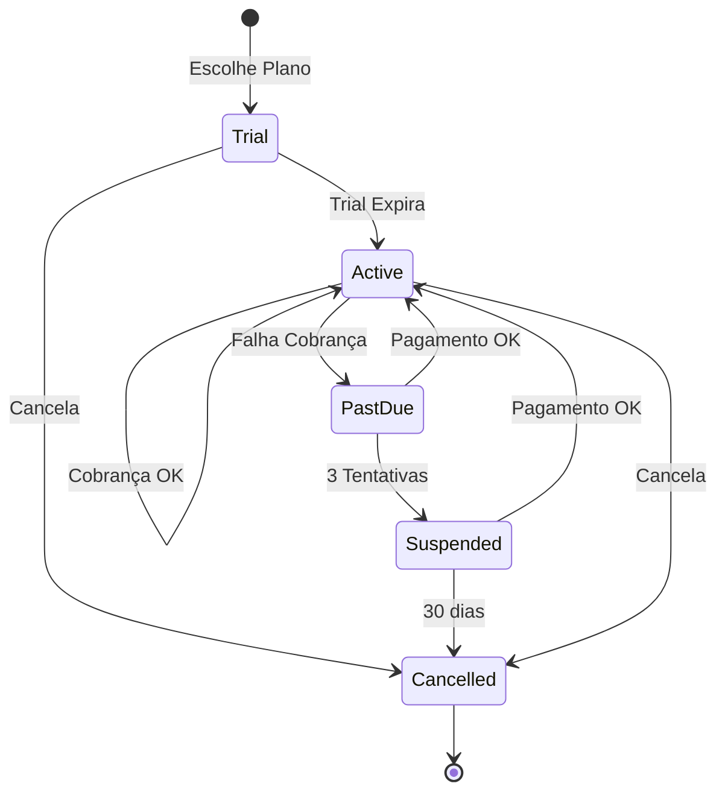

# 🏢 SaaS Subscriptions - Cobrança Recorrente via Checkout Transparente

## 📋 Visão Geral do Modelo

**Modelo de Negócio SaaS:** Plataforma cobra mensalidades dos estabelecimentos através de subscriptions recorrentes usando checkout transparente (Mercado Pago, Stripe, Razorpay).

### 🎯 Objetivos
- **Cobrança automática** mensal dos estabelecimentos
- **Checkout transparente** sem redirecionamento
- **Gestão de planos** flexível (Trial, Lite, Pro, Premium)
- **Dashboard Super Admin** para controle total
- **Integração multi-gateway** (Mercado Pago, Stripe, Razorpay)

---

## 🏗️ Arquitetura do Sistema de Subscriptions

### **1. Fluxo de Cobrança SaaS**

```
┌─────────────────┐    ┌──────────────────┐    ┌─────────────────┐
│   Estabelecimento │    │  Checkout        │    │   Gateway       │
│   Escolhe Plano   │───▶│  Transparente    │───▶│   (MP/Stripe)   │
└─────────────────┘    └──────────────────┘    └─────────────────┘
         │                       │                       │
         ▼                       ▼                       ▼
┌─────────────────┐    ┌──────────────────┐    ┌─────────────────┐
│  Subscription   │    │  Payment Intent  │    │   Confirmação    │
│   Criada        │◀───│   Autorizado      │◀───│   Instantânea    │
└─────────────────┘    └──────────────────┘    └─────────────────┘
```

### **2. Estados da Subscription**



---

## 📊 Estrutura de Dados - Backend (MongoDB)

### **1. Collection: `subscriptions`**

```javascript
{
  _id: ObjectId,
  establishment_id: ObjectId, // Referência para establishment
  plan_id: ObjectId, // Referência para plan

  // Status e Controle
  status: 'trial' | 'active' | 'past_due' | 'suspended' | 'cancelled',
  billing_cycle: 'monthly' | 'annual',

  // Períodos
  current_period_start: Date,
  current_period_end: Date,
  trial_start: Date,
  trial_end: Date,

  // Cobrança
  amount: Number, // Valor atual do plano
  currency: 'BRL',
  next_billing_date: Date,

  // Gateway Integration
  gateway: 'mercado_pago' | 'stripe' | 'razorpay',
  gateway_subscription_id: String, // ID da subscription no gateway
  gateway_customer_id: String, // ID do cliente no gateway
  gateway_payment_method_id: String, // Método de pagamento salvo

  // Controle de Tentativas
  failed_payment_attempts: Number, // Tentativas falhadas consecutivas
  last_payment_attempt: Date,
  next_retry_date: Date,

  // Configurações
  auto_renew: Boolean, // default: true
  proration_enabled: Boolean, // default: true

  // Metadados
  created_by: ObjectId, // Super Admin que criou
  cancelled_at: Date,
  cancellation_reason: String,

  created_at: Date,
  updated_at: Date
}
```

### **2. Collection: `subscription_payments`**

```javascript
{
  _id: ObjectId,
  subscription_id: ObjectId,
  establishment_id: ObjectId,

  // Dados do Pagamento
  amount: Number,
  currency: 'BRL',
  status: 'pending' | 'succeeded' | 'failed' | 'refunded',

  // Gateway
  gateway: 'mercado_pago' | 'stripe' | 'razorpay',
  gateway_payment_id: String,
  gateway_charge_id: String,

  // Período Cobrado
  billing_period_start: Date,
  billing_period_end: Date,

  // Tentativas
  attempt_number: Number, // 1, 2, 3...
  failure_reason: String,

  // Metadados
  invoice_url: String, // Link para fatura
  receipt_url: String, // Link para recibo

  created_at: Date,
  updated_at: Date
}
```

### **3. Collection: `plans`** (Atualizada)

```javascript
{
  _id: ObjectId,
  name: String, // "Plano Lite", "Plano Pro"
  slug: String, // "lite", "pro"
  type: 'trial' | 'lite' | 'pro' | 'premium',

  // Preços
  price_monthly: Number,
  price_annual: Number,
  currency: 'BRL',

  // Configurações
  billing_cycle: 'monthly' | 'annual',
  trial_days: Number, // Dias de trial grátis
  max_users: Number,
  max_items: Number,
  max_categories: Number,

  // Features
  features: {
    api_calls_limit: Number,
    storage_gb: Number,
    support_level: 'email' | 'priority' | '24/7',
    custom_domain: Boolean,
    analytics: Boolean
  },

  // Gateway Integration
  gateway_plans: {
    mercado_pago: {
      plan_id: String,
      preapproval_id: String
    },
    stripe: {
      product_id: String,
      price_id_monthly: String,
      price_id_annual: String
    },
    razorpay: {
      plan_id: String
    }
  },

  // Controle
  status: 'active' | 'inactive' | 'deprecated',
  is_popular: Boolean, // Destaque no checkout

  created_at: Date,
  updated_at: Date
}
```

---

## 🔧 Implementação Backend - Node.js/Express

### **1. Serviço de Subscriptions**

```javascript
// services/subscription.service.js
const mongoose = require('mongoose');
const Subscription = require('../models/subscription.model');
const SubscriptionPayment = require('../models/subscription-payment.model');
const Plan = require('../models/plan.model');
const mercadoPagoService = require('./mercado-pago.service');
const stripeService = require('./stripe.service');

class SubscriptionService {

  /**
   * Criar subscription com checkout transparente
   */
  async createSubscription(establishmentId, planId, paymentMethodData, gateway = 'mercado_pago') {
    const plan = await Plan.findById(planId);
    if (!plan || plan.status !== 'active') {
      throw new Error('Plano não encontrado ou inativo');
    }

    // Calcular datas
    const now = new Date();
    const trialEnd = plan.trial_days ? new Date(now.getTime() + plan.trial_days * 24 * 60 * 60 * 1000) : now;
    const currentPeriodEnd = new Date(trialEnd.getTime() + 30 * 24 * 60 * 60 * 1000); // 30 dias

    // Criar subscription no gateway
    let gatewayData;
    switch (gateway) {
      case 'mercado_pago':
        gatewayData = await mercadoPagoService.createSubscription(plan, paymentMethodData, establishmentId);
        break;
      case 'stripe':
        gatewayData = await stripeService.createSubscription(plan, paymentMethodData, establishmentId);
        break;
      default:
        throw new Error('Gateway não suportado');
    }

    // Criar subscription local
    const subscription = new Subscription({
      establishment_id: establishmentId,
      plan_id: planId,
      status: plan.trial_days > 0 ? 'trial' : 'active',
      billing_cycle: 'monthly',
      current_period_start: now,
      current_period_end: currentPeriodEnd,
      trial_start: plan.trial_days > 0 ? now : null,
      trial_end: trialEnd,
      amount: plan.price_monthly,
      currency: 'BRL',
      next_billing_date: currentPeriodEnd,
      gateway: gateway,
      gateway_subscription_id: gatewayData.subscription_id,
      gateway_customer_id: gatewayData.customer_id,
      gateway_payment_method_id: gatewayData.payment_method_id,
      auto_renew: true,
      failed_payment_attempts: 0
    });

    await subscription.save();

    // Agendar primeira cobrança se não há trial
    if (!plan.trial_days) {
      await this.scheduleNextBilling(subscription._id);
    }

    return subscription;
  }

  /**
   * Processar cobrança recorrente
   */
  async processRecurringBilling(subscriptionId) {
    const subscription = await Subscription.findById(subscriptionId)
      .populate('establishment_id')
      .populate('plan_id');

    if (!subscription || subscription.status !== 'active') {
      return;
    }

    try {
      // Criar cobrança no gateway
      const paymentResult = await this.chargeSubscription(subscription);

      // Registrar pagamento
      await SubscriptionPayment.create({
        subscription_id: subscriptionId,
        establishment_id: subscription.establishment_id,
        amount: subscription.amount,
        currency: subscription.currency,
        status: 'succeeded',
        gateway: subscription.gateway,
        gateway_payment_id: paymentResult.payment_id,
        billing_period_start: subscription.current_period_start,
        billing_period_end: subscription.current_period_end,
        attempt_number: 1
      });

      // Atualizar período da subscription
      subscription.current_period_start = subscription.current_period_end;
      subscription.current_period_end = new Date(subscription.current_period_end.getTime() + 30 * 24 * 60 * 60 * 1000);
      subscription.next_billing_date = subscription.current_period_end;
      subscription.failed_payment_attempts = 0;
      subscription.last_payment_attempt = new Date();

      await subscription.save();

      // Agendar próxima cobrança
      await this.scheduleNextBilling(subscriptionId);

    } catch (error) {
      await this.handlePaymentFailure(subscription, error);
    }
  }

  /**
   * Cancelar subscription
   */
  async cancelSubscription(subscriptionId, reason = '') {
    const subscription = await Subscription.findById(subscriptionId);
    if (!subscription) {
      throw new Error('Subscription não encontrada');
    }

    // Cancelar no gateway
    switch (subscription.gateway) {
      case 'mercado_pago':
        await mercadoPagoService.cancelSubscription(subscription.gateway_subscription_id);
        break;
      case 'stripe':
        await stripeService.cancelSubscription(subscription.gateway_subscription_id);
        break;
    }

    // Atualizar localmente
    subscription.status = 'cancelled';
    subscription.cancelled_at = new Date();
    subscription.cancellation_reason = reason;
    subscription.auto_renew = false;

    await subscription.save();

    return subscription;
  }

  /**
   * Upgrade/Downgrade de plano
   */
  async changePlan(subscriptionId, newPlanId) {
    const subscription = await Subscription.findById(subscriptionId)
      .populate('plan_id');
    const newPlan = await Plan.findById(newPlanId);

    if (!subscription || !newPlan) {
      throw new Error('Subscription ou plano não encontrado');
    }

    // Calcular proration se necessário
    const prorationAmount = this.calculateProration(subscription, newPlan);

    // Atualizar no gateway
    switch (subscription.gateway) {
      case 'mercado_pago':
        await mercadoPagoService.updateSubscription(subscription.gateway_subscription_id, newPlan, prorationAmount);
        break;
      case 'stripe':
        await stripeService.updateSubscription(subscription.gateway_subscription_id, newPlan, prorationAmount);
        break;
    }

    // Atualizar localmente
    subscription.plan_id = newPlanId;
    subscription.amount = newPlan.price_monthly;

    await subscription.save();

    return subscription;
  }

  /**
   * Agendar próxima cobrança
   */
  async scheduleNextBilling(subscriptionId) {
    const subscription = await Subscription.findById(subscriptionId);
    if (!subscription || !subscription.auto_renew) return;

    // Usar agenda (ex: node-cron, agenda.js, ou similar)
    const agenda = require('../agenda');

    await agenda.schedule(subscription.next_billing_date, 'process-recurring-billing', {
      subscriptionId: subscriptionId
    });
  }

  /**
   * Calcular proration para mudança de plano
   */
  calculateProration(subscription, newPlan) {
    const now = new Date();
    const periodTotal = subscription.current_period_end - subscription.current_period_start;
    const periodUsed = now - subscription.current_period_start;
    const periodRemaining = periodTotal - periodUsed;

    const currentPlanDailyRate = subscription.amount / 30;
    const newPlanDailyRate = newPlan.price_monthly / 30;

    const prorationAmount = (newPlanDailyRate - currentPlanDailyRate) * (periodRemaining / (24 * 60 * 60 * 1000));

    return Math.max(0, prorationAmount); // Não cobrar negativo
  }

  /**
   * Tratar falha de pagamento
   */
  async handlePaymentFailure(subscription, error) {
    subscription.failed_payment_attempts += 1;
    subscription.last_payment_attempt = new Date();

    // Registrar tentativa falhada
    await SubscriptionPayment.create({
      subscription_id: subscription._id,
      establishment_id: subscription.establishment_id,
      amount: subscription.amount,
      status: 'failed',
      gateway: subscription.gateway,
      failure_reason: error.message,
      attempt_number: subscription.failed_payment_attempts
    });

    // Lógica de retry baseada em tentativas
    if (subscription.failed_payment_attempts >= 3) {
      subscription.status = 'suspended';
      subscription.next_retry_date = new Date(Date.now() + 7 * 24 * 60 * 60 * 1000); // 7 dias
    } else {
      // Agendar retry
      const retryDelays = [1, 3, 7]; // dias
      const retryDelay = retryDelays[subscription.failed_payment_attempts - 1] || 7;
      subscription.next_retry_date = new Date(Date.now() + retryDelay * 24 * 60 * 60 * 1000);
    }

    await subscription.save();

    // Notificar estabelecimento
    await this.notifyPaymentFailure(subscription);
  }

  /**
   * Notificar falha de pagamento
   */
  async notifyPaymentFailure(subscription) {
    // Implementar notificação por email/SMS
    const establishment = subscription.establishment_id;

    // Enviar email de cobrança
    // Enviar SMS se configurado
    // Log de notificação
  }

  /**
   * Cobrar subscription no gateway
   */
  async chargeSubscription(subscription) {
    switch (subscription.gateway) {
      case 'mercado_pago':
        return await mercadoPagoService.chargeSubscription(subscription);
      case 'stripe':
        return await stripeService.chargeSubscription(subscription);
      default:
        throw new Error('Gateway não suportado');
    }
  }
}

module.exports = new SubscriptionService();
```

### **2. Integração Mercado Pago**

```javascript
// services/mercado-pago.service.js
const mercadopago = require('mercadopago');

class MercadoPagoService {

  constructor() {
    mercadopago.configure({
      access_token: process.env.MERCADO_PAGO_ACCESS_TOKEN
    });
  }

  /**
   * Criar subscription no Mercado Pago
   */
  async createSubscription(plan, paymentMethodData, establishmentId) {
    try {
      // Criar customer
      const customer = await mercadopago.customers.create({
        email: paymentMethodData.email,
        first_name: paymentMethodData.first_name,
        last_name: paymentMethodData.last_name,
        identification: {
          type: paymentMethodData.identification.type,
          number: paymentMethodData.identification.number
        }
      });

      // Criar payment method
      const paymentMethod = await mercadopago.payment_methods.create({
        customer_id: customer.id,
        token: paymentMethodData.token
      });

      // Criar preapproval (subscription recorrente)
      const preapproval = await mercadopago.preapprovals.create({
        payer_id: customer.id,
        reason: `Assinatura ${plan.name}`,
        external_reference: `sub_${establishmentId}_${Date.now()}`,
        auto_recurring: {
          frequency: 1,
          frequency_type: 'months',
          transaction_amount: plan.price_monthly,
          currency_id: 'BRL',
          start_date: new Date(Date.now() + (plan.trial_days || 0) * 24 * 60 * 60 * 1000).toISOString(),
          end_date: null // Indefinido para recorrência infinita
        },
        payment_method_id: paymentMethod.id
      });

      return {
        subscription_id: preapproval.id,
        customer_id: customer.id,
        payment_method_id: paymentMethod.id
      };

    } catch (error) {
      console.error('Erro ao criar subscription MP:', error);
      throw new Error('Falha ao criar assinatura');
    }
  }

  /**
   * Cobrar subscription recorrente
   */
  async chargeSubscription(subscription) {
    try {
      // O Mercado Pago cobra automaticamente baseado na preapproval
      // Verificar status da cobrança mais recente
      const payments = await mercadopago.payment.search({
        external_reference: subscription.gateway_subscription_id
      });

      const lastPayment = payments.results[0];
      if (!lastPayment) {
        throw new Error('Nenhum pagamento encontrado');
      }

      if (lastPayment.status === 'approved') {
        return {
          payment_id: lastPayment.id,
          status: 'succeeded'
        };
      } else {
        throw new Error(`Pagamento ${lastPayment.status}: ${lastPayment.status_detail}`);
      }

    } catch (error) {
      console.error('Erro ao cobrar subscription MP:', error);
      throw error;
    }
  }

  /**
   * Cancelar subscription
   */
  async cancelSubscription(preapprovalId) {
    try {
      await mercadopago.preapprovals.update({
        id: preapprovalId,
        status: 'cancelled'
      });
    } catch (error) {
      console.error('Erro ao cancelar subscription MP:', error);
      throw error;
    }
  }

  /**
   * Atualizar subscription (upgrade/downgrade)
   */
  async updateSubscription(preapprovalId, newPlan, prorationAmount) {
    try {
      // Se há proration, criar cobrança adicional
      if (prorationAmount > 0) {
        await mercadopago.payment.create({
          transaction_amount: prorationAmount,
          description: `Proration - ${newPlan.name}`,
          payment_method_id: 'preapproval',
          preapproval_id: preapprovalId,
          external_reference: `proration_${preapprovalId}_${Date.now()}`
        });
      }

      // Atualizar valor recorrente
      await mercadopago.preapprovals.update({
        id: preapprovalId,
        auto_recurring: {
          transaction_amount: newPlan.price_monthly
        }
      });

    } catch (error) {
      console.error('Erro ao atualizar subscription MP:', error);
      throw error;
    }
  }
}

module.exports = new MercadoPagoService();
```

---

## 🎨 Frontend - Angular/Ionic

### **1. Componente de Checkout Transparente**

```typescript
// components/subscription-checkout/subscription-checkout.component.ts
import { Component, Input } from '@angular/core';
import { ModalController, LoadingController, ToastController } from '@ionic/angular';
import { SubscriptionService } from '../../services/subscription/subscription.service';
import { MercadoPagoService } from '../../services/mercado-pago/mercado-pago.service';
import { Plan } from '../../models/plan.model';

@Component({
  selector: 'app-subscription-checkout',
  templateUrl: './subscription-checkout.component.html',
  styleUrls: ['./subscription-checkout.component.scss'],
})
export class SubscriptionCheckoutComponent {
  @Input() plan: Plan;

  paymentData = {
    cardNumber: '',
    expiryMonth: '',
    expiryYear: '',
    cvv: '',
    holderName: '',
    identification: {
      type: 'CPF',
      number: ''
    }
  };

  constructor(
    private modalCtrl: ModalController,
    private subscriptionService: SubscriptionService,
    private mercadoPagoService: MercadoPagoService,
    private loadingCtrl: LoadingController,
    private toastCtrl: ToastController
  ) {}

  async processSubscription() {
    const loading = await this.loadingCtrl.create({
      message: 'Processando assinatura...'
    });
    await loading.present();

    try {
      // 1. Criar token do cartão no Mercado Pago
      const cardToken = await this.mercadoPagoService.createCardToken({
        cardNumber: this.paymentData.cardNumber,
        expiryMonth: this.paymentData.expiryMonth,
        expiryYear: this.paymentData.expiryYear,
        cvv: this.paymentData.cvv,
        holderName: this.paymentData.holderName
      });

      // 2. Preparar dados do pagamento
      const paymentMethodData = {
        token: cardToken.id,
        payment_method_id: 'credit_card',
        issuer_id: cardToken.issuer_id,
        installments: 1,
        email: 'establishment@example.com', // Pegar do estabelecimento logado
        first_name: this.paymentData.holderName.split(' ')[0],
        last_name: this.paymentData.holderName.split(' ').slice(1).join(' '),
        identification: this.paymentData.identification
      };

      // 3. Criar subscription
      const subscription = await this.subscriptionService.createSubscription(
        this.plan._id,
        paymentMethodData,
        'mercado_pago'
      ).toPromise();

      // 4. Sucesso
      const toast = await this.toastCtrl.create({
        message: 'Assinatura criada com sucesso!',
        duration: 3000,
        color: 'success'
      });
      await toast.present();

      this.modalCtrl.dismiss({ success: true, subscription });

    } catch (error) {
      console.error('Erro na subscription:', error);

      const toast = await this.toastCtrl.create({
        message: error.error?.message || 'Erro ao processar assinatura',
        duration: 3000,
        color: 'danger'
      });
      await toast.present();

    } finally {
      await loading.dismiss();
    }
  }

  dismiss() {
    this.modalCtrl.dismiss({ success: false });
  }
}
```

### **2. Template HTML do Checkout**

```html
<!-- subscription-checkout.component.html -->
<ion-header>
  <ion-toolbar>
    <ion-title>Assinar {{ plan?.name }}</ion-title>
    <ion-buttons slot="end">
      <ion-button (click)="dismiss()">
        <ion-icon name="close"></ion-icon>
      </ion-button>
    </ion-buttons>
  </ion-toolbar>
</ion-header>

<ion-content>
  <ion-card>
    <ion-card-header>
      <ion-card-title>{{ plan?.name }}</ion-card-title>
      <ion-card-subtitle>R$ {{ plan?.price_monthly }}/mês</ion-card-subtitle>
    </ion-card-header>

    <ion-card-content>
      <p>{{ plan?.description }}</p>

      <!-- Trial Badge -->
      <ion-badge *ngIf="plan?.trial_days" color="success">
        {{ plan.trial_days }} dias grátis
      </ion-badge>
    </ion-card-content>
  </ion-card>

  <!-- Formulário de Pagamento -->
  <form (ngSubmit)="processSubscription()">
    <ion-item>
      <ion-label position="floating">Número do Cartão</ion-label>
      <ion-input
        [(ngModel)]="paymentData.cardNumber"
        name="cardNumber"
        placeholder="1234 5678 9012 3456"
        required>
      </ion-input>
    </ion-item>

    <ion-row>
      <ion-col size="6">
        <ion-item>
          <ion-label position="floating">Mês</ion-label>
          <ion-input
            [(ngModel)]="paymentData.expiryMonth"
            name="expiryMonth"
            placeholder="MM"
            required>
          </ion-input>
        </ion-item>
      </ion-col>
      <ion-col size="6">
        <ion-item>
          <ion-label position="floating">Ano</ion-label>
          <ion-input
            [(ngModel)]="paymentData.expiryYear"
            name="expiryYear"
            placeholder="YYYY"
            required>
          </ion-input>
        </ion-item>
      </ion-col>
    </ion-row>

    <ion-item>
      <ion-label position="floating">CVV</ion-label>
      <ion-input
        [(ngModel)]="paymentData.cvv"
        name="cvv"
        placeholder="123"
        required>
      </ion-input>
    </ion-item>

    <ion-item>
      <ion-label position="floating">Nome no Cartão</ion-label>
      <ion-input
        [(ngModel)]="paymentData.holderName"
        name="holderName"
        placeholder="João Silva"
        required>
      </ion-input>
    </ion-item>

    <ion-item>
      <ion-label position="floating">CPF</ion-label>
      <ion-input
        [(ngModel)]="paymentData.identification.number"
        name="cpf"
        placeholder="123.456.789-00"
        required>
      </ion-input>
    </ion-item>

    <ion-button
      expand="block"
      type="submit"
      class="ion-margin">
      Assinar por R$ {{ plan?.price_monthly }}/mês
    </ion-button>
  </form>

  <!-- Termos -->
  <ion-text class="ion-text-center ion-margin">
    <p class="ion-text-small">
      Ao assinar, você concorda com nossos
      <a href="#" target="_blank">Termos de Uso</a> e
      <a href="#" target="_blank">Política de Privacidade</a>
    </p>
  </ion-text>
</ion-content>
```

---

## 📊 Dashboard Super Admin

### **1. Gestão de Subscriptions**

```typescript
// pages/super/subscriptions/subscriptions.page.ts
import { Component, OnInit } from '@angular/core';
import { SubscriptionService } from '../../../services/subscription/subscription.service';
import { Subscription } from '../../../models/subscription.model';

@Component({
  selector: 'app-subscriptions',
  templateUrl: './subscriptions.page.html',
  styleUrls: ['./subscriptions.page.scss'],
})
export class SubscriptionsPage implements OnInit {
  subscriptions: Subscription[] = [];
  loading = false;

  statusFilter = 'all';
  gatewayFilter = 'all';

  constructor(private subscriptionService: SubscriptionService) {}

  ngOnInit() {
    this.loadSubscriptions();
  }

  async loadSubscriptions() {
    this.loading = true;
    try {
      const result = await this.subscriptionService.getAllSubscriptions().toPromise();
      this.subscriptions = result.subscriptions;
    } catch (error) {
      console.error('Erro ao carregar subscriptions:', error);
    } finally {
      this.loading = false;
    }
  }

  async cancelSubscription(subscription: Subscription) {
    const reason = prompt('Motivo do cancelamento:');
    if (!reason) return;

    try {
      await this.subscriptionService.updateStatus(subscription._id, 'cancelled', reason).toPromise();
      subscription.status = 'cancelled';
    } catch (error) {
      console.error('Erro ao cancelar:', error);
    }
  }

  getStatusColor(status: string): string {
    const colors = {
      'active': 'success',
      'trial': 'warning',
      'past_due': 'danger',
      'suspended': 'danger',
      'cancelled': 'medium'
    };
    return colors[status] || 'primary';
  }

  getFilteredSubscriptions() {
    return this.subscriptions.filter(sub => {
      const statusMatch = this.statusFilter === 'all' || sub.status === this.statusFilter;
      const gatewayMatch = this.gatewayFilter === 'all' || sub.gateway === this.gatewayFilter;
      return statusMatch && gatewayMatch;
    });
  }
}
```

### **2. Métricas SaaS**

```typescript
// services/analytics/analytics.service.ts
export class AnalyticsService {

  async getSaaSMetrics() {
    return {
      // Receita Recorrente Mensal (MRR)
      mrr: await this.calculateMRR(),

      // Receita Recorrente Anual (ARR)
      arr: await this.calculateARR(),

      // Churn Rate
      churnRate: await this.calculateChurnRate(),

      // Lifetime Value (LTV)
      ltv: await this.calculateLTV(),

      // Customer Acquisition Cost (CAC)
      cac: await this.calculateCAC(),

      // Subscriptions por status
      subscriptionsByStatus: await this.getSubscriptionsByStatus(),

      // Receita por plano
      revenueByPlan: await this.getRevenueByPlan()
    };
  }

  private async calculateMRR() {
    // Soma de todas as subscriptions ativas
    const activeSubscriptions = await Subscription.find({ status: 'active' });
    return activeSubscriptions.reduce((total, sub) => total + sub.amount, 0);
  }

  private async calculateChurnRate() {
    // Taxa de cancelamento mensal
    const startOfMonth = new Date();
    startOfMonth.setDate(1);

    const cancelledThisMonth = await Subscription.countDocuments({
      status: 'cancelled',
      cancelled_at: { $gte: startOfMonth }
    });

    const totalActive = await Subscription.countDocuments({
      status: 'active'
    });

    return (cancelledThisMonth / (totalActive + cancelledThisMonth)) * 100;
  }
}
```

---

## 🔄 Webhooks e Automação

### **1. Webhook Mercado Pago**

```javascript
// routes/webhooks/mercado-pago.routes.js
const express = require('express');
const router = express.Router();
const subscriptionService = require('../../services/subscription.service');

router.post('/subscriptions', async (req, res) => {
  try {
    const { action, data } = req.body;

    switch (action) {
      case 'payment.created':
        await handlePaymentCreated(data);
        break;
      case 'payment.updated':
        await handlePaymentUpdated(data);
        break;
      case 'subscription.cancelled':
        await handleSubscriptionCancelled(data);
        break;
    }

    res.json({ success: true });
  } catch (error) {
    console.error('Erro no webhook MP:', error);
    res.status(500).json({ error: 'Erro interno' });
  }
});

async function handlePaymentCreated(paymentData) {
  // Registrar pagamento bem-sucedido
  const subscription = await Subscription.findOne({
    gateway_subscription_id: paymentData.preapproval_id
  });

  if (subscription) {
    await subscriptionService.processSuccessfulPayment(subscription._id, paymentData);
  }
}

async function handlePaymentUpdated(paymentData) {
  // Atualizar status do pagamento
  if (paymentData.status === 'rejected') {
    const subscription = await Subscription.findOne({
      gateway_subscription_id: paymentData.preapproval_id
    });

    if (subscription) {
      await subscriptionService.handlePaymentFailure(subscription._id, paymentData);
    }
  }
}

module.exports = router;
```

---

## 📈 Estratégia de Pricing SaaS

### **1. Estrutura de Planos**

| Plano | Preço/Mês | Usuários | Itens | Categorias | Suporte |
|-------|-----------|----------|-------|------------|---------|
| Trial | R$ 0 | 1 | 50 | 5 | Email |
| Lite | R$ 49 | 2 | 500 | 10 | Email |
| Pro | R$ 99 | 5 | 2000 | 25 | Prioritário |
| Premium | R$ 199 | 10 | ∞ | ∞ | 24/7 |

### **2. Funcionalidades por Plano**

```typescript
// Configuração de limites por plano
const PLAN_LIMITS = {
  trial: {
    max_users: 1,
    max_items: 50,
    max_categories: 5,
    api_calls_limit: 1000,
    storage_gb: 1,
    support_level: 'email'
  },
  lite: {
    max_users: 2,
    max_items: 500,
    max_categories: 10,
    api_calls_limit: 10000,
    storage_gb: 5,
    support_level: 'email'
  },
  pro: {
    max_users: 5,
    max_items: 2000,
    max_categories: 25,
    api_calls_limit: 50000,
    storage_gb: 25,
    support_level: 'priority'
  },
  premium: {
    max_users: 10,
    max_items: -1, // Ilimitado
    max_categories: -1,
    api_calls_limit: 200000,
    storage_gb: 100,
    support_level: '24/7'
  }
};
```

---

## 🚀 Próximos Passos de Implementação

### **Fase 1: Core Subscription System**
- [ ] Implementar modelos MongoDB
- [ ] Criar serviço de subscriptions backend
- [ ] Integrar Mercado Pago para recorrência
- [ ] Implementar checkout transparente frontend

### **Fase 2: Gestão e Monitoramento**
- [ ] Dashboard Super Admin para subscriptions
- [ ] Sistema de notificações de cobrança
- [ ] Webhooks para pagamentos automáticos
- [ ] Relatórios de MRR/ARR/Churn

### **Fase 3: Advanced Features**
- [ ] Upgrade/Downgrade com proration
- [ ] Trial management
- [ ] Dunning management (recuperação de pagamentos)
- [ ] Multi-gateway support (Stripe + Razorpay)

### **Fase 4: Otimização**
- [ ] Analytics avançados
- [ ] Machine learning para churn prediction
- [ ] A/B testing de preços
- [ ] Integração com ferramentas de cobrança

---

## 💰 Estratégia de Receita SaaS

### **Modelo Freemium → Premium**
1. **Trial Grátis** (7-14 dias) - Hook inicial
2. **Conversão para Pago** - Upgrade baseado em limites
3. **Upselling** - Funcionalidades premium
4. **Expansão** - Aumento de usuários/limites

### **Métricas de Sucesso**
- **MRR Growth**: Crescimento mensal da receita recorrente
- **Churn Rate**: < 5% mensal (meta)
- **LTV/CAC Ratio**: > 3:1 (meta)
- **Payback Period**: < 12 meses (meta)

Esta arquitetura permite uma operação SaaS robusta e escalável, com cobrança automática e transparente para maximizar a receita recorrente.